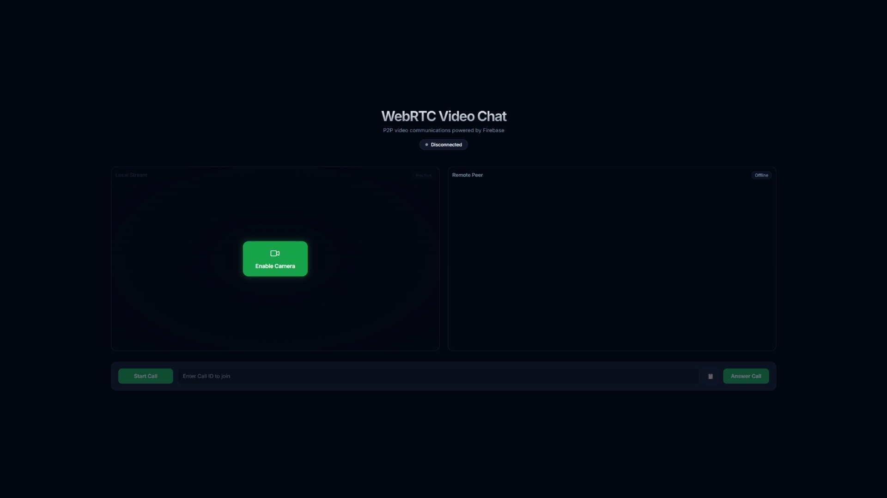

# WebRTC Peer-to-Peer Video Chat & Screen Sharing

A lightweight, serverless peer-to-peer (P2P) video communication web application utilizing WebRTC for direct media streaming and Firebase for signaling.


Live Demo: [https://temokoki.github.io/WebRTC_Video_Chat/](https://temokoki.github.io/WebRTC_Video_Chat/)

## Features

- **P2P Video & Audio**: Direct connection between two browsers using standard RTCPeerConnection APIs.
- **Screen Sharing**: Dynamic switching between camera streams and desktop media streams on-the-fly.
- **Firebase Signaling**: Supports real-time connection negotiation via both Firebase Cloud Firestore and Firebase Realtime Database (RTDB).
- **Responsive Web Interface**: Modern UI styled with vanilla CSS, including a connection status monitor and toast notifications.
- **Anonymous Authentication**: Secure signaling sessions using Firebase Anonymous Authentication.

## Tech Stack

- **Frontend**: Vanilla HTML5, CSS3, ES6 JavaScript
- **Build Tool**: Vite
- **WebRTC**: Native Browser WebRTC API (STUN/ICE negotiation)
- **Signaling & Auth**: Firebase Firestore / Realtime Database, Firebase Authentication

## Getting Started

### Prerequisites

- Node.js (version 18 or higher recommended)
- A Firebase Project (with RTDB or Firestore, and Anonymous Auth enabled)

### Installation

1. Clone the repository:
   ```bash
   git clone https://github.com/temokoki/WebRTC_Video_Chat.git
   cd WebRTC_Video_Chat
   ```

2. Install dependencies:
   ```bash
   npm install
   ```

3. Configure Firebase:
   Create a configuration file at `src/firebase-config.js` and paste your Firebase SDK settings:
   ```javascript
   import { initializeApp } from "firebase/app";
   import { getAuth } from "firebase/auth";
   import { getDatabase } from "firebase/database";
   import { getFirestore } from "firebase/firestore";

   const firebaseConfig = {
     apiKey: "YOUR_API_KEY",
     authDomain: "YOUR_AUTH_DOMAIN",
     projectId: "YOUR_PROJECT_ID",
     storageBucket: "YOUR_STORAGE_BUCKET",
     messagingSenderId: "YOUR_MESSAGING_SENDER_ID",
     appId: "YOUR_APP_ID"
   };

   export const app = initializeApp(firebaseConfig);
   export const auth = getAuth(app);
   export const db = getDatabase(app); // For Realtime Database
   // export const db = getFirestore(app); // For Firestore
   ```

### Running Locally

To start the local development server:
```bash
npm run dev
```

### Build and Deployment

To build the project for production:
```bash
npm run build
```

To deploy to GitHub Pages:
```bash
npx gh-pages -d dist
```
